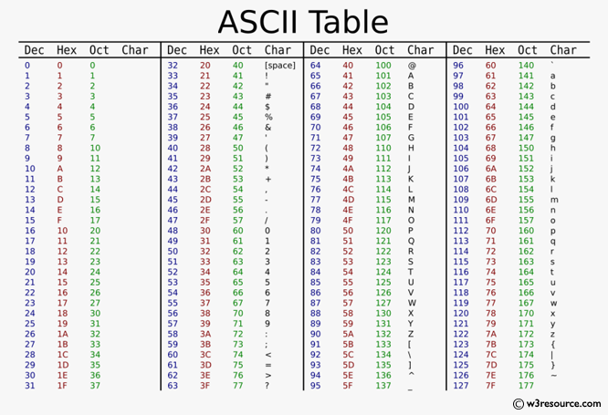

# Revise Modern C++

**Core features | Standard library | STL**

_Topics to cover:_

1. <a href="#data">Data types</a>
2. <a href="#">Control Flow</a>
3. <a href="#">Functions</a>
4. <a href="#">Pointers</a>
5. <a href="#">Classes</a>
6. <a href="#">Inheritance</a>
7. <a href="#">Polymorphism</a>

## Data Types
<div id="data"></div>

Data types is C++ are grouped into 3. The *primitive* , *derived types* , *user defined* .

| Data type | Alias | Memory |
|-----------|-------|--------|
|integer    | `int` | 4 bytes|
|float      |`float`| 4 bytes|
|double     |`double`| 8 bytes|
|boolean    |`bool` | 1 byte |
|character    |`char` | 1 byte |

### Variables

**Variable:** It is used to name piece of memory that stores specific data types.

Types of Variable initialization

* Braced initialization
  ```c++
  int number {};
  ```
* Functional initialization
  ```c++
  int number();
  ```
* Assignment initialization
  ```c++
  int number = 0;
  ```
**NB:** Braced initialization doesn't support narrowing conversion.

### Integers

* `unsigned int` for positive integers only. Range is about $0 \to 2^n -1$.
* `signed int` for both positive and negative integers. It ranges from $-2^{n-1} \to 2^{n-1}-1$

**n is the number of bits for a type in memory. 8 bits = 1byte**

* `short int`, `signed short`, `unsigned short int` are **2 bytes**.
* `long int`, `signed long int`, `unsigned long int` are either **4 or 8 bytes**. 
  ```c++
    long int num {12} // 4 bytes
    long int num {123456} // 8 bytes
  ```

### Floating

For storing numbers with decimals.

|Type|Size|Precision|Flag|
|----|----|---------|----|
|float|4 bytes| $\approx$ 7|f|
|double| 8 bytes | 15 |
|long double| 12 bytes | > double|L|

**N.B:** 
* Use `setprecision()` to control the precision.
```c
#include iomanip
std::cout << std::setprecision(20);
```
* $\dfrac{\pm floating point}{o} = \pm 0, \hspace{7mm}\dfrac{0.0}{0.0} = NaN$

### Boolean

It is either *true or false*. It is used for decision making. Traditionally, any zero value is interpreted as false; any nonzero value is
interpreted as true.

True rep by 1 
False rep by 0

**N.B:** 
You can print true or false using `boolalpha`.
```c++
#include <iostream>

std::cout << std::boolaplha
```

### Character

Character data type is used for storing characters. The keyword used for the character data type is `char`. Characters typically require 1 byte of memory space and range from -128 to 127 or 0 to 255.

* single quote for char as in `' '` but double or single quote for string as in `" "`.



If you assign numerical value to `char` you probably get a corresponding character on the ASCII table.

### Auto

It let the compiler deduce the data type itself. It is useful when we have longer type name.

**Note:**
* You must always initialize `auto` type.
  ```c++
  auto var {}; // compile error
  auto var {2022}
  ```
* Don't reassign value different to data type to auto.
  ```c++
  auto var {"August 2022"};
  var = 56; // compile error
  ```
* Different auto declaration
  ```c++
  auto var1 = 2022;
  auto var2(2022);
  auto var3 = { 2022 };
  auto var4{ 2022 };
  ```
  The first two statements do, indeed, declare a variable of type int with value 27. The second two, however, declare a variable of type `std::initializer_list<int>` containing a single element with value 27!