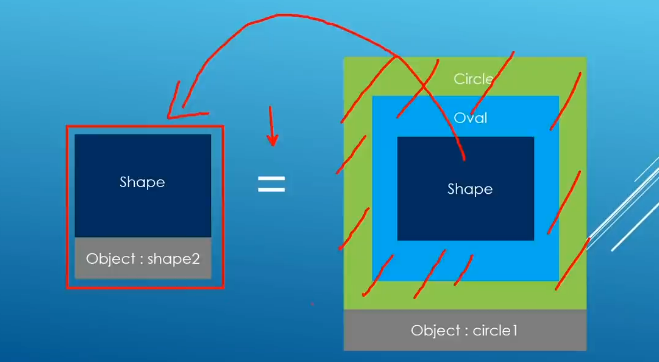

# Polymorphism

In C++, polymorphism always involves the use of a pointer or a reference to an object to call a member function. Polymorphism only operates with classes that share a common base class.

## Pasing base pointers or references to functions

```c++
void draw_shape(Shape* shape_ptr){
    shape_ptr-> draw();
}

void draw_shape(const Shape& shape){
    shape->draw();
}
```

### Static binding with base class pointer and reference

The static binding is due to the class inhertance hierarchy. The compiler will determine the pointer to know which method to call in inheritance hierarchy.

### Why Polymorphism
* To avoid repetitive method on an objects.
```c++
// pointer
void draw_shape(Shape* shape_ptr){
    shape_ptr -> draw();
}

// reference
void draw_shape(const Shape& shape_ptr){
    shape_ptr -> draw();
}
```
* To store collection of objects of the same class in array.

```c++
Shape shape1("shape1");
Oval oval1(2.0,3.5,"oval1");
Circle circle1(3.3, "circle1")

Shape* shape_collection[]{&shape1, &oval1, &circle};

for (Shape* s_ptr : shape_collection){
    s_ptr -> draw();
}
```

## Dynamic binding

When you specify a function as virtual in a base class you indicate to the compiler that you want dynamic binding for function calls in any class that’s derived from this base class. A virtual function is declared in a base class by using the keyword `virtual`.

However, the compiler will not be considering the type pointer but rather the value (address) assigned to it. You make virtual function calls using a variable whose type is a pointer or a reference to a base class object. 

The virtual keyword applied to the function in the base class is sufficient to determine that all definitions of the function in derived classes will also be virtual. You can optionally usethe virtual keyword for your derived class functions as well.

### Requirement of virtual function operation

The return type of a virtual function in a derived class must be the same as that in the base class as well.

## Size of Polymorphism

The use of dynamic binding is great but it has a setback in terms of the memory it takes. With dynamic binding, object will be much larger. 

**Slicing:** When you try to assign object of an derived class which has additional parameter to base class, `slicing` occurs whereby the derived member variable or method is stripe off.



## Storing Polymorphic objects in collections 

Use a pointer point a class to store an object in a collection. You can also store in smart pointer. If you store raw data in an array set up to store base class object, the data is going to slice off.

```c++
    Shape* shape [] {&circle1, &oval1, &circle2, &oval2};

    // Pointer
    for (Shape* shape_ptr : shape){
        shape_ptr -> draw();
    }

    // Smart pointers
    std::shared_ptr<Shape> shape [] {std::make_shared<Circle>(12.2, "circle1"), std::make_shared<Oval>(10.0,20.0,"oval1")};

    for (auto& s : shape){
        s -> draw();
    }
```

## Override
It’s easy to make a mistake in the specification of a virtual function in a derived class. Let's a typo mistake. Instead of `draw()` in base may be we write `Draw()` in derived class. The compiler wil still compile but the error is sometimes hard to notice or debug.

Similarly, if you define a volume() function in a derived class but forget to specify `const`, this function will `overload` instead of `override` the base class function.

You can protect against such errors by using the `override` specifier for every virtual function declaration in a derived class.

**Note:** It is recommended to use override in inheritance hierarchy to detect typos in virtual function.

### Overloading, overriding and hiding.

When you override a single function of base func overloads in derived class, it will only override the function but all other overloads will be hidden.