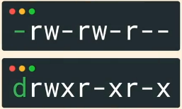
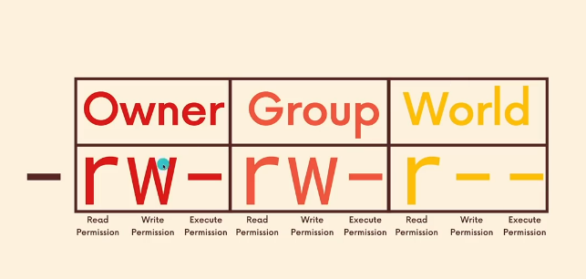
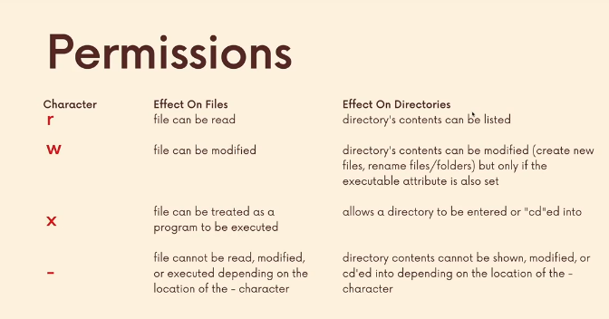

# Linux Basis

## Table of Contents

## The World of Operating System
Most Operating system (OS) can be grouped into **two** families:
1. The Microscoft NT descendents e.g Windows, Xbox OS, and Windows Phone/Mobile.
2. Unix: Mac OS X, Linux, Andriod, Chrome OS, and even the PS4 OS.

## Understanding Permision
### File Type 
The very first character when you list `ls -l` indicates the type of the files. Some of the mosre common types and their corresponding attributes are:

`-` regular file
`d` directory
`c` character special file
`l` symbolic link

### Permission Character
Permission characters are 9 altogether, grouped into 3 namely: Owner, group, and World.

The uses: 

