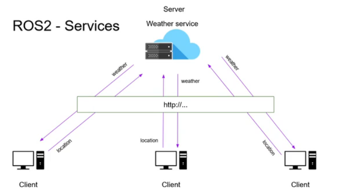

# Service

The mode of communication in ROS2 are `topic` and `service`. 
- Topic communicate continously/repeatedly but Service communicate for a specified period of time i.e `momentarily`
- Topics are used for data stream while Service is used for Server - Client communication
- A synchronous mode of communication using `services` and, an asynchronous mode of communication with the publisher/subscriber system. 
- Service is bidirectional asynchronous or synchronous while topic is unidirectional asynchronous.
- Services re mostly used for actions or computation. Hence, the naming starts with a verb.
- **N.B:** A service server can only exist once, but can have many clients.

## Analogy

An analogy of a web app is used. The computer/smartphone used to browse is the `Client` while an `API` called is the `Server` through hyperprotocol transfer (https) which is the `Service`.


## Commands
- To list the availabe service
  ```
  ros2 service list
  ```
- To check the message type, append `-t` flag
  ```
  ros2 service list -t
  ```
- To call a service
  ```
  ros2 service call <service_name> <service_type>
  ```
- To show service interface
  ```
  ros2 interface show <service_type>
  ```

## Writing ROS2 Service Server in python 

The source code <a href="./ros2_ws/src/pkg_cpp_py/scripts/add_two_ints_server.py">here</a>

**Code explain:**
```py
class Server(Node):
    def __init__(self):
        super().__init__("add_two_ints")
        self.server = self.create_service(AddTwoInts, "add_two_ints", self.add_two_ints_cb)
        self.get_logger().info("Server has just been created...")

    def add_two_ints_cb(self, request, response):
        response.sum = request.a + request.b
        return response
```

1. Create the server and add the `msg_type`, `service_name` and a `callback` as parameter.
2. Define the callback function with two parameters for the `request` and `response`
```py
def callback(self, request, response):
  pass
```

## Writing ROS2 Service Client in python 

- Client with Functional programming: click <a href="./ros2_ws/src/pkg_py/pkg_py/add_two_ints_client.py">here</a>
- Client with Object-oriented programming: click <a href="./ros2_ws/src/pkg_py/pkg_py/add_two_ints_oop_client.py">here</a>
- Simple mini client with OOP: click <a href="./ros2_ws/src/pkg_cpp_py/scripts/add_two_ints_client.py">here</a>

**Code explained:**
```py
def main(args=None):
    rclpy.init(args=args)
    node = Node("add_two_ints_no_oop")

    client = node.create_client(AddTwoInts, "add_two_ints")

    # wait for the server
    while not client.wait_for_service(1.0):
        node.get_logger().warn("Waiting for server...")

    request = AddTwoInts.Request()
    request.a = 3
    request.b = 8

    # asynchronous call
    future = client.call_async(request)
    rclpy.spin_until_future_complete(node, future)

    try:
        response = future.result()
        node.get_logger().info(f'{request.a} + {request.b} = {response.sum}')
    except Exception as e:
        node.get_logger().error("Service call failed: %r",(e,))

    rclpy.shutdown()
```

1. Instantiate a node class.
2. Create client from the node as in line 70
3. Inorder not to encounter problem while connecting to a server, check if the server is up and running.
```py
while not client.wait_for_service(1.0):
        node.get_logger().warn("Waiting for server...")
```
`wait_for_service(timeout)` is a method called on the client object.
4. Instantiate the request as in line 76.
5. The client makes request asynchronously
```py
future = client.call_async(request)
rclpy.spin_until_future_complete(node, future)
```
6. The server give response which could be failed or succeeded, hence, the error is handled.
```py
    try:
        response = future.result()
        node.get_logger().info(f'{request.a} + {request.b} = {response.sum}')
    except Exception as e:
        node.get_logger().error("Service call failed: %r",(e,))
```