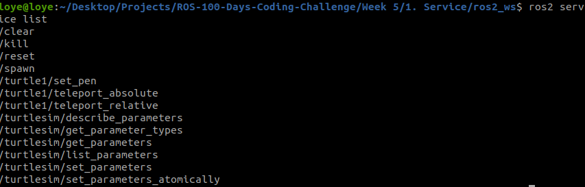

# Turtle Services

In ROS turtlesim, you can use different services.

## Command 
- Launch the turtlesim node
    ```
    ros2 run turtlesim turtlesim_node
    ```
- To check the services available
  ```
  ros2 service list
  ```


`/clear` to clear the path or line drawn by the turtle
`/kill` to kill the turtle
`/reset` to reset the pose of a turtle
`/spawn` to add new turtle

- To check/get the service type
  ```
  ros2 service list -t

  OR

  ros2 service type /service_name
  ```
- To show service interface
  ```
  ros2 interface show /service_type
  ```
- To call a service
  ```
  ros2 service call <service_name> <service_type> args
  ```