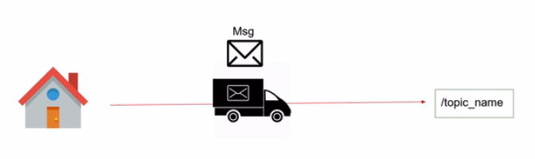
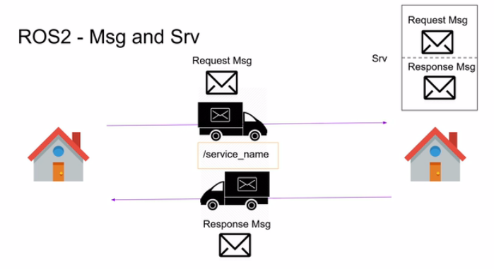
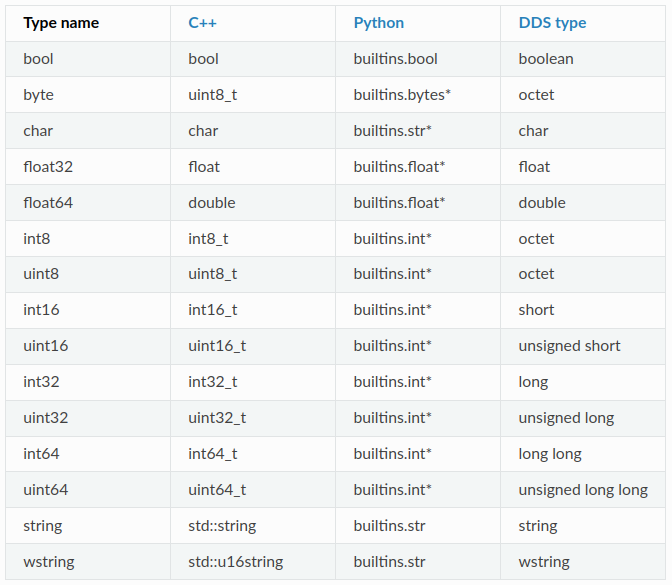
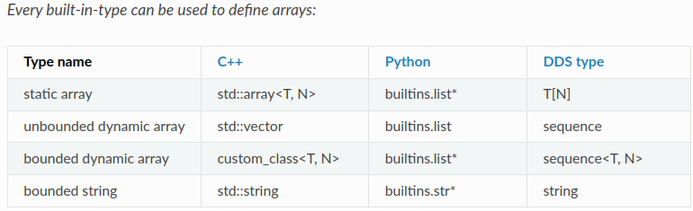

# ROS2 Interfaces
These are the messages (msg) and services (srv) used with Topic and Service respectively. Here you will know how to create a custom msg and srv.

## Msg & Srv
Analogy of a Message and Service




Read more <a href="https://docs.ros.org/en/rolling/Concepts/About-ROS-Interfaces.html" target="_blank">here</a> or Github <a href="https://github.com/ros2/common_interfaces" target="_blank">link</a>

## Interface Data Types



## Create Custom Interfaces

- For custom interfaces, create a package conventionally called `robot_interfaces` in the workspace.
  ```
  ros2 pkg create custom_interfaces
  ```
- Remove/delete the `include` and `src` folder
  ```
    rm -rf include/ src/
  ```
- Create `msg` folder
  ```
    mkdir msg srv
  ```
- Edit the `package.xml` file by adding:
  ```xml
    <build_depend>rosidl_default_generators</build_depend>
    <exec_depend>rosidl_default_runtime</exec_depend>
    <member_of_group>rosidl_interface_packages</member_of_group>
  ```
- Edit the `CMakeLists.txt` file:
  ```c
    # find dependencies
    find_package(rosidl_default_generators REQUIRED)

    rosidl_generate_interfaces(${PROJECT_NAME}
        "msg/HardwareStatus.msg"
    )
  ```

### Custom Message
- In the `msg` folder, create a msg file
- The file name should be in `UpperCamelCase`
- As in, `CustomMessage.msg`
- Generate interfaces in the `CMakeLists.txt`