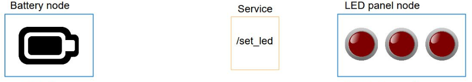

# LED Indicator 

In this workspace, there is an implementation of battery + led panel example used to understand the concept of ROS2 Topic and Services. The LED indicate the state of the battery.

- The LED has 3 diode with different color (red, yellow, green) 
- When battery is low the red color is ON.
- When is the battery is at average level, the yellow is ON.
- When the battery is fully charged, the green is ON.

## Publisher & Subscriber

- The battery being the publisher node
- The LED being the subcriber node
- Assuming there is a multimeter `/battery_state` which serves as a `topic`.

## Service Server and Client

- The Battery being the server that return response to set LED.
- The LED is the client that request for the battery state to know which LED to ON or OFF.
- The service name chosen as `/set_led` where bidirectional communication happens btw server and client.

## Algo

- At first the battery is full, that is, green LED is ON ([red, yellow, green])
- [red, yellow, green] = [0,0,1]
- Let's fake the battery state
  - Assuming after a min the ba3 power decreases to average hence yellow LED is ON ([red, yellow, green])
  - [red, yellow, green] = [0,1,0]
  - After 2 mins the ba3 is low hence red LED is ON. ([red, yellow, green])
  - [red, yellow, green] = [1,0,0]
  - The battery shut down after 30secs hence all LEDs are OFF
  - [red, yellow, green] = [0,0,0]
- It take the battery 4 min to be fully charged.
- Continue the loop until the node is shutdown