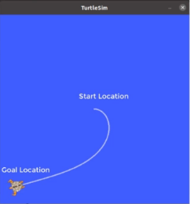

# Motion types
There are different types of motion in ROS
1. Straight line
2. Rotation in place
3. Spiral
4. Go to goal 

## Straight line
For a straight line motion in ROS (turtlesim), you just have to specify a constant speed.

```
Linear:
    x: speed
    y: 0
    z: 0
Angular:
    x = 0
    y = 0
    z = 0
```

## Rotation in place
The turtle rotates at a constant angular speed.

```
Linear:
    x: 0
    y: 0
    z: 0
Angular:
    x = 0
    y = 0
    z = speed
```

## Spiral targetory
It is also a rotational motion but the linear speed is a function of time.

```
Linear:
    x: f(time)
    y: 0
    z: 0
Angular:
    x = 0
    y = 0
    z = constant
```

## Go to goal 

The concept of go-to-goal falls under the PID (Proportion, Integral, Derivative) controller.



```
Linear:
    x: f(distance)
    y: 0
    z: 0
Angular:
    x = 0
    y = 0
    z = f(angle)
```

### Moving from point to point
A proportional controller

**Moving from point $(x_1, y_1)$  to $(x_2, y_2)$**
* Linear velocity: $v = k_v \sqrt{(x_2 - x_1)^2 + (y_2 - y_1)^2}$
* Angular velocity: $\theta = tan^{-1}\dfrac{y_2 - y_1}{x_2 - x_1}$
* Proportional controller to minimize angle between goal angle and initial angle. $\gamma = K_h(\theta_2\hspace{3mm} \Theta \hspace{3mm} \theta 1), K_h > 0$
* $K_h$ is a constant depending on robot, friction and so on.


# Motion in space

In ground robot, the motion is only in 2D space but in flying robot; the motion is in 3D space.

For ground robot:

```
Linear:
    x: variable
    y: 0
    z: 0
```
`y` will be zero because it not a holonomic robot and `z` will be zero because it is not a flying robot.