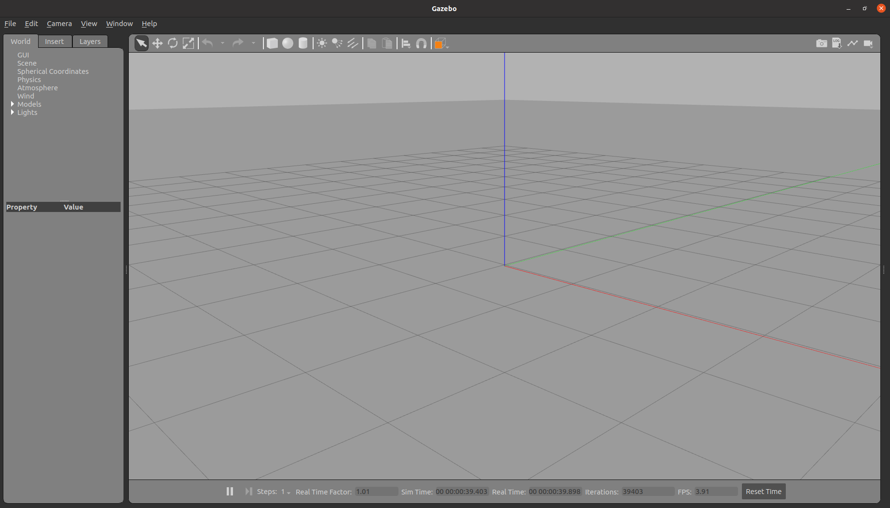
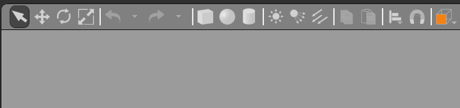

# GAZEBO
Gazebo is a simulator for robotics environments maintained by the **Open Source Robotics Foundation (OSRF)**. It allows you to test algorithms rapidly, design robots, train AI systems, and more.

It provides dynamic simulations that you can choose among different physic engines, advanced 3D graphics, sensors and noises, plugins for robots, and ready-to-use robot models.

There are **three** tabs: 
1. World 
2. Insert
3. Layers

**Gzserver and Gzclient**
Gazebo has both processes divided, meaning the simulation does not need the GUI to run.

* Gzserver is basically for simulating the physics sensors, rendering.
* Gzclient, for example, provides graphical interface to visualize and simulation.
* Gz server and client communicate using gazebo library.

## World
The world is the simulation's whole environment. It contains everything and is described in a `.world` file. 

Gazebo world frame follows the right-hand orientation - the red line for X-axis, green for Y-axis, and blue for Z-axis

### Model 
All the models are composed of links. Some of them are even composed of other models. Models are also described with SDF. They can be described inside a world file or in a separate file(.sdf) to be reused as often as needed.

## Plugins
Gazebo plugins are used to interface Gazebo with external programs. There are two ways of loading such plugins: command line or inside the SDF files.

When working with ROS, plugins are loaded in the SDF file since you use launch files to start a simulation. Your launch files include URDF robot models, which are converted to SDF when passed to Gazebo.

## Graphial User Interface
The gzclient is responsible for the gazebo graphical interface.

### Toolbar

The first four options are useful for selecting, moving, rotating, and scaling models in the simulation.

- **Selector**: To select different model.
- **Translation mode:** To select and drag any model into the simulation. It will follow the mouse pointer if you keep the left button pressed.
- **Rotational mode:** The three possible rotation angles will be displayed as circles whenever you select the model to be rotated. Drag one of them to rotate the model.
- **Scale mode:** To scale a single model by enlarging or reducing the size.

Snap tool 

Snap is another option to put objects together. Make a try of these options. They are very helpful in putting objects in the desired position when creating worlds.